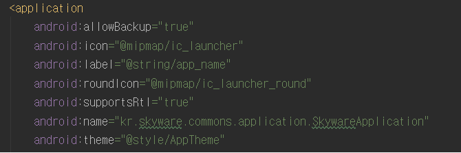

# droid-common
* 사용방법

* [app build.gradle]
* dependencies 추가
<pre>
<code>
implementation 'com.skyware:droid-commons:1.0.1-RELEASE'
</code>
</pre>
---
* [project build.gradle]
* 스크립트 추가 Maven

```gradle
buildscript {
    repositories {
        ...
        maven {url "http://1.221.205.250:9495/nexus/content/repositories/releases"}	//<-- 추가
    }
    ...
}
```
```gradle
allprojects {
    repositories {
        ...
        maven {url "http://1.221.205.250:9495/nexus/content/repositories/releases"}	//<-- 추가
    }
}
```

---
* **Notification Manager**
* FireBase Cloud Messaging
> 참고 
> [Firebase console][https://console.firebase.google.com/u/0/project/skyware-3ca62/settings/general/android:kr.skyware.commons] <br/>

<pre>
- 생성 앱 애플리케이션을 Manifest.xml 에 SkywareApplication 을 등록해준다. 
끝.
</pre>  


---

* **SkyAsyncHttpClient**
```java
//사용 예시 : get method
public static void get(String url, RequestParams params, SkyAsyncHttpResponseHandler responseHandler)  {
    client.get(getAbsoluteUrl(url), params, responseHandler);
}
//use
get("{url}", params, new SkyJsonHttpResponseHandler(){
    @Override
    public void onSuccess(int statusCode, Header[] headers, String responseString) {
        super.onSuccess(statusCode, headers, responseString);
    }
    ...
    @Override
    public void onFailure(int statusCode, Header[] headers, String responseString, Throwable throwable) {
        super.onFailure(statusCode, headers, responseString, throwable);
    }
    ...
});
```
<pre>
<code>
※ post, put, delete 등 각 HTTP METHOD별 사용하기 편리하게 구현하여 사용하면 됨.
</code>
</pre>
---
  
* **SQLITE**
    * SkyDBHelper, SkyDBProvider, SkyDBData

Class | 의미 
---|:---:|
`SkyDBHelper` | 로컬 데이터베이스에 테이블 생성 역활(현재 user, history 테이블을 생성하게 되있음)
`SkyDBProvider` | 쿼리 공급자 역활수행
`SkyDBData` | user, history table 초기 값 설정(사용안해도됨)  
  
  
  
  
  
  
---
> 인용 : cz_msebera_android_httpclient 4.3.* (안드로이드 라이브러리) <br/>
> _(지속적으로 입맛에 맞게 변경하여 사용하기)_ <br/>
> created by jayKim. <br/>
---